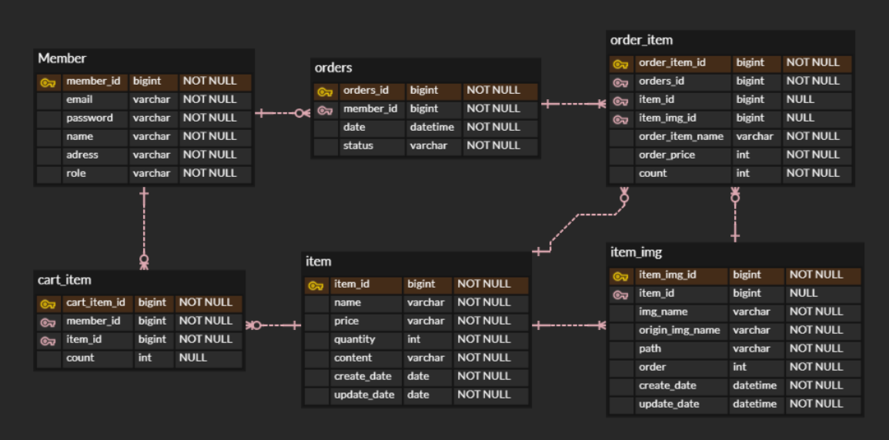

# spring-shop（未完成）

使用技術

html, css, javascript

spring boot, mybatis, mysql, gradle, spring security

## api

| function         | method | uri               |説明|
|------------------|--------|-------------------|---|
| main page        | GET    | /                 ||
| Login page       | GET    | /login            ||
| signup page      | GET    | /signup           ||
| signup           | POST   | /signup           ||
| item page        | GET    | /items/{itemId}   ||
| item add page    | GET    | /items/add        ||
| item add         | POST   | /items/add        ||
| item delete      | DELETE | /items/{itemId}   ||
| cart page        | GET    | /carts            ||
| cart item add    | POST   | /carts/{itemId}   ||
| cart item delete | POST   | /carts/delete     ||
| order page       | GET    | /orders           ||
| order add        | POST   | /orders           ||
| order delete     | DELETE | /orders/{orderId} ||

## ERD

## 予定

アイテム修正 など
